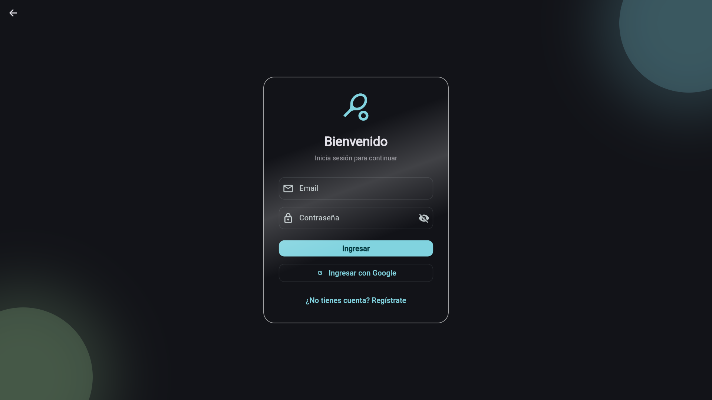
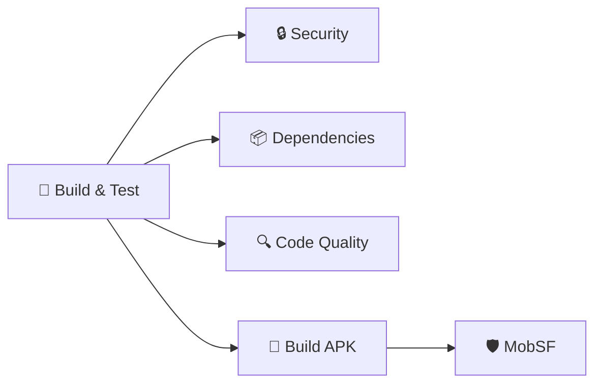
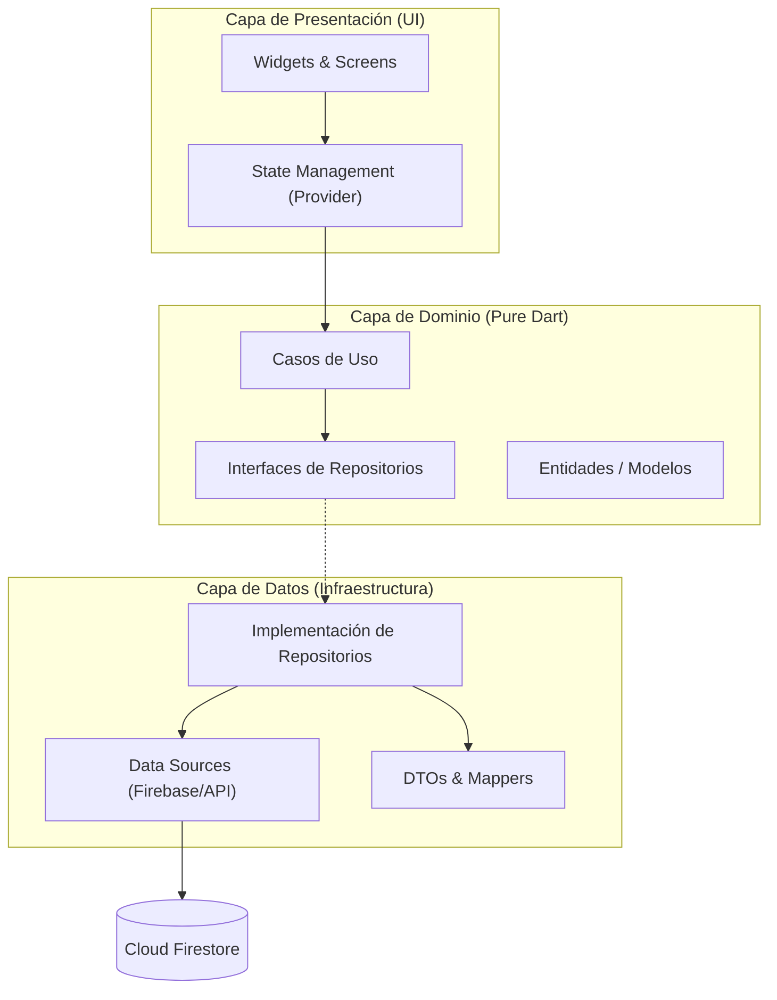

# 🎾 Tie Break

[](https://github.com/aguschazaaa-sudo/tie-break/actions/workflows/ci.yml)
[](https://flutter.dev)
[](https://dart.dev)
[](https://github.com/resocoder/flutter-clean-architecture-proposal)
[](https://pub.dev/packages/very_good_analysis)
[](LICENSE)

> **La plataforma definitiva para gestión de clubes y ligas de pádel amateur.**

Tie Break no es solo una app de reservas; es una solución completa de gestión deportiva diseñada con una arquitectura escalable y robusta, enfocada en la experiencia de usuario y la integridad de los datos.

---

## 📱 Galería

| Login / Auth | Landing & Dashboard |
|:---:|:---:|
|  |  |

---

## 💡 Ingeniería y Arquitectura

Este proyecto fue desarrollado pensando en **escalabilidad y mantenibilidad**, simulando un entorno de producción real. No es solo código que funciona, es código diseñado para durar.

### Características Técnicas Clave

*   **Clean Architecture**: Separación estricta de responsabilidades en capas (`Domain`, `Data`, `Presentation`). Esto permite cambiar la base de datos o la interfaz sin romper la lógica de negocio.
*   **Programación Funcional (`fpdart`)**: Uso de tipos como `Either` para un manejo de errores robusto. No más `try-catch` dispersos; los errores son parte del flujo de datos tipado.
*   **Testing Moderno**:
    *   **Unit Tests**: Lógica de negocio blindada.
    *   **Golden Tests**: Pruebas de regresión visual para asegurar pixel-perfection en cada commit (usando `golden_toolkit`).
*   **Inyección de Dependencias**: Gestión de estado y dependencias desacopladas usando `Provider` y patrones de repositorio.

### 🔄 Pipeline de CI/CD

Pipeline automatizado con **GitHub Actions** que ejecuta en cada push/PR:



| Stage | Herramienta | Descripción |
|-------|-------------|-------------|
| **Build & Test** | Flutter | Formato, análisis estático, tests unitarios |
| **Security** | Trivy | Escaneo de vulnerabilidades (CVEs) con umbrales configurables |
| **Dependencies** | Dart Pub | Auditoría de paquetes desactualizados |
| **Code Quality** | DCM | Detección de código y archivos sin usar |
| **Build APK** | Flutter + Gradle | Compilación del APK con secrets de Firebase |
| **MobSF** | Docker | Análisis de seguridad estático del APK (SAST) |

**Artifacts generados**: Reportes de seguridad, calidad de código y el APK compilado.

> **Nota**: Los archivos de workflow usan el patrón de *Reusable Workflows* para mantener modularidad sin perder la visualización unificada del pipeline.

### Diagrama de Arquitectura



---

## ✨ Funcionalidades

### 🏟️ Para Jugadores
- **Reservas en Tiempo Real**: Sistema anti-colisiones para evitar doble reserva.
- **Matchmaking (Falta Uno)**: Encuentra partidos que necesitan jugadores.
- **Perfil de Jugador**: Estadísticas, nivel de juego y seguimiento de historial.

### 🏢 Para Clubes (Administración)
- **Dashboard de Gestión**: Control total sobre canchas y horarios.
- **Aprobación de Reservas**: Flujo de validación para solicitudes.
- **Reglas de Negocio**: Configuración de precios dinámicos y políticas de cancelación.

---

## 🛠️ Stack Tecnológico

| Categoría | Tecnología | Justificación |
|-----------|------------|---------------|
| **Core** | Flutter & Dart | Desarrollo multiplataforma nativo de alto rendimiento. |
| **Backend** | Firebase (Auth, Firestore) | Infraestructura serverless escalable en tiempo real. |
| **Estado** | Provider | Gestión de estado eficiente y "Flutter-native". |
| **Funcional** | fpdart | Manejo de errores seguro y pipelines de datos funcionales. |
| **UI/UX** | Glassmorphism | Estética moderna y diferenciadora. |
| **QA** | Mocktail & Golden Toolkit | Estrategia de testing completa (Unitario + Visual). |
| **Linter** | Very Good Analysis | Estándares de código estrictos para máxima calidad. |

---

## 🚀 Cómo correr el proyecto

### Prerrequisitos
- Flutter SDK 3.7.2+
- Configuración de Firebase propia (ver abajo)

### Instalación

1. **Clonar repositorio**
   ```bash
   git clone https://github.com/aguschazaaa-sudo/tie-break.git
   cd tie-break
   ```

2. **Instalar dependencias**
   ```bash
   flutter pub get
   ```

3. **Configuración de Entorno**
   El proyecto utiliza Firebase. Deberás configurar tu propio proyecto:
   - Instala FlutterFire CLI.
   - Ejecuta `flutterfire configure` y selecciona tu proyecto.

4. **Ejecutar**
   ```bash
   flutter run
   ```

5. **Correr Tests**
   ```bash
   flutter test            # Unit tests
   flutter test --update-goldens # Generar Goldens (si cambiaste UI)
   ```

---

## 📄 Licencia

Este proyecto es **software propietario**. Todos los derechos reservados © 2026 Agustín Chazarreta.

No está permitido copiar, modificar, distribuir o usar este software sin autorización previa por escrito.

---

<p align="center">
  <sub>Desarrollado con ❤️ y mucho ☕ por Agustín Chazarreta.</sub>
</p>
